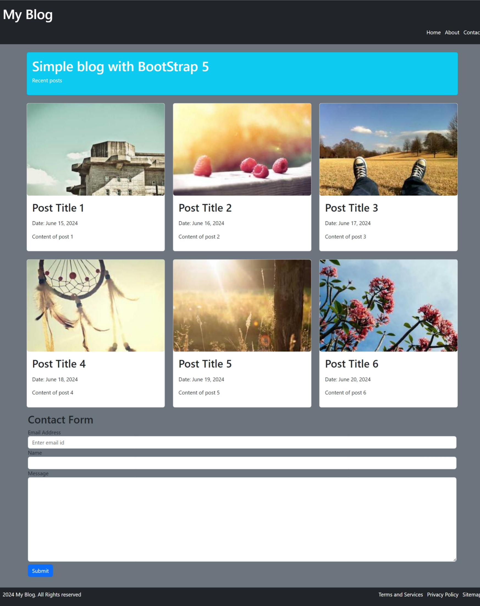

# My Blog Bootstrap



Welcome to My Blog Bootstrap project! This is a simple blog page designed using Bootstrap 5. It features a responsive layout with a header, post cards, a contact form, and a footer.

## Live Demo

Check out the live demo of the website [here](https://sivashankar-selvan.github.io/Myblogbootstrap/).

## Features

- **Responsive Design:** The blog page is fully responsive and works well on all devices, including desktops, tablets, and mobile phones.
- **Bootstrap 5:** Utilizes the latest Bootstrap 5 framework for styling and layout.
- **Navigation Bar:** A sticky navigation bar that remains at the top as you scroll.
- **Post Cards:** Display recent posts with images, titles, dates, and content snippets.
- **Contact Form:** A simple contact form to collect email addresses, names, and messages.
- **Footer:** A footer with links to Terms and Services, Privacy Policy, and Sitemap.

## Project Structure

- `index.html`: The main HTML file that contains the structure of the webpage.
- `favicon_io/`: Directory containing favicon files of different sizes and formats.
- `css/`: Directory for custom CSS files.
<!--- `js/`: Directory for custom JavaScript files.-->

## Getting Started

To get a local copy up and running follow these simple steps.

### Prerequisites

- A modern web browser
- Internet connection

### Installation

1. Clone the repo

   ```sh
   git clone https://github.com/sivashankar-selvan/Myblogbootstrap.git
